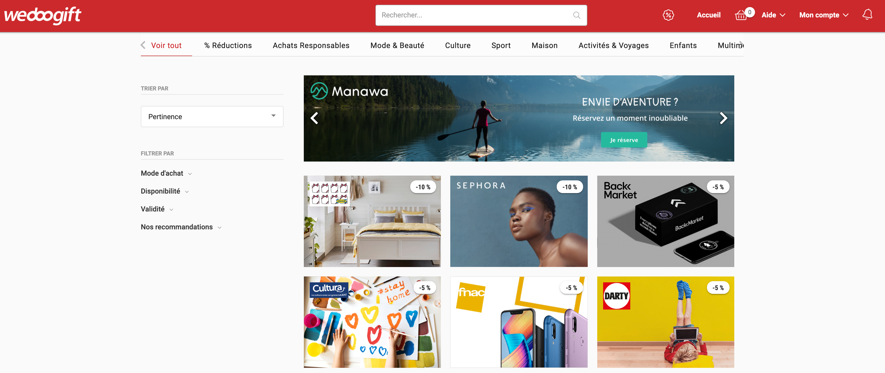

# Wedoogift DevOps challenge
You are interested in joining our DevOps team ? try to accomplish this challenge, we will be glad to see
your work and give you a feedback.

## Expected deliverable
* Architecture Diagram with the relevant AWS components, you can choose any tools to create your diagram. (Must Have)
* Describe why you chose each component. (Must Have)
* CloudFormation template corresponding to your architecture. (Optional)

## Problem to solve

Using the search bar on the Offerwall page, users can find the shop they are looking for.
To improve our offer, we want to know what users are looking for. 
Everytime a user write a brand in the search bar, we want to log it somewhere. Then we want to be able to have some insights on the searched brands.
Your mission is to suggest a cloud architecture on AWS to help developers implementing the solution.
